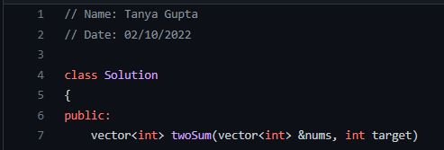

# LeetCode-Problems-Solutions

# Hacktoberfest-2022🔥

<br>
<p align="center">
  
</p>

### Feel free to use this project to make your first contribution to an open-source project on GitHub. Practice making your first pull request to a public repository before doing the real thing!

### This repository is open to all members of the GitHub community. Any member can contribute to this project!

# Guidelines

0. Contribute a LeetCode Problem. 

1. Always create an issue before making a Pull Request. 

2. Make a Pull Request only after the issue has been assigned to you by the owner. Otherwise, your PR will be closed automatically.

3. Write the issue number while creating a Pull Request. 

   Example: Write ````#30```` if the issue number of that problem is 30.

4. The Program should be executable, with 0 errors and proper documentation.

5. Codes are only allowed in C++, Java and Python. 

6. Do not add a code if it exists already.

7. Explain your code with the help of comments.

8. Writing the author's name and the date modified is a must.

   Example:
   <p align="left">
     
   </p>

9. Filename should follow the order
       ````ProblemNumber_ProblemName.extension````
   If there are 2 or more than 2 words than the first letter of each word must be capital.
  
      Example:   ````1_TwoSum.cpp````
       
10. Don't spam it will be rejected immediately.

## **YOU MAY USE THESE LINKS TO FORMAT YOUR CODE**

C++ FORMATTER    :  https://codebeautify.org/cpp-formatter-beautifier

JAVA FORMATTER   :  https://codebeautify.org/javaviewer

PYTHON FORMATTER :  https://codebeautify.org/python-formatter-beautifier


# Steps For Contribution

0. Star <a href="https://github.com/tanyagupta0201/LeetCode-Problems-Solutions" title="this">this</a> repository.

1. Fork <a href="https://github.com/tanyagupta0201/LeetCode-Problems-Solutions" title="this">this</a> repository.

2. Clone the forked repository.
```css
git clone https://github.com/<your-github-username>/LeetCode-Problems-Solutions
```
  
3. Navigate to the project directory.
```py
cd LeetCode-Problems-Solutions
```

4. Create a new branch.
```css
git checkout -b <your_branch_name>
```

5. Make changes.

6. Stage your changes and commit
```css
git add -A

git commit -m "<your_commit_message>"
```

7. Push your local commits to the remote repo.
```css
git push -u origin <your_branch_name>
```

8. Create a Pull Request.

9. Congratulations! 🎉 you've made your contribution.


---
